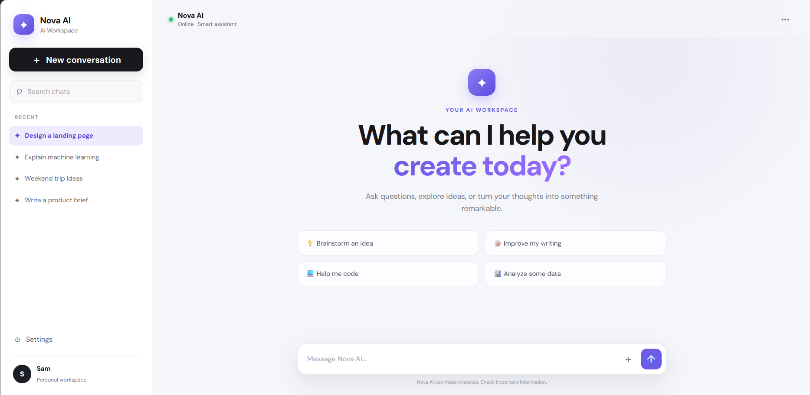
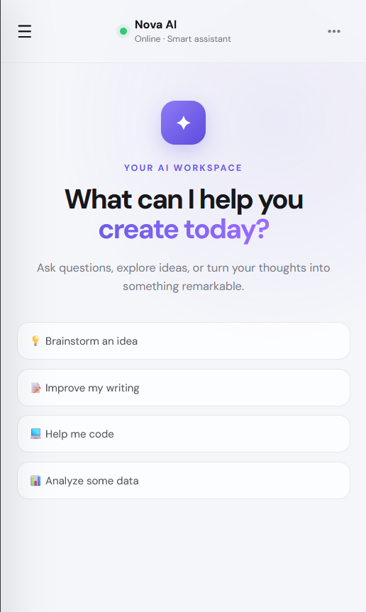

# Nova AI — Chat Sidebar

## UI Template Collection Hackathon

### Topic
**AI Chat Sidebar**

### Submission Type
Individual Project

### Member
Punshuk-Reddy-7

---

## 1. About the UI Pattern

An AI Chat Sidebar is a modern interface pattern used in AI assistants and productivity applications. It combines a conversation area with a sidebar that provides access to previous conversations, search, settings, and workspace controls.

This pattern helps users quickly move between conversations while keeping the main workspace focused on the current interaction.

---

## 2. Relevance to Modern Web Interfaces

AI-powered interfaces are becoming an important part of modern web applications. Chat-based interfaces provide a simple way for users to interact with AI for tasks such as brainstorming, writing, coding, and data analysis.

A sidebar-based layout improves navigation and keeps frequently used conversations easily accessible.

---

## 3. Design and Interaction Patterns

The following design patterns were considered while creating the interface:

- Sidebar navigation for recent conversations
- New conversation action
- Search for conversations
- AI online status indicator
- Welcome screen with a clear primary heading
- Suggested prompt cards
- User and AI message bubbles
- Fixed chat composer
- Responsive mobile navigation
- Hover and interaction states
- Clean spacing, rounded components, and modern typography

---

## 4. Implemented UI

The project implements a modern AI workspace called **Nova AI**.

Main features include:

- Nova AI branding
- Recent conversation sidebar
- New conversation button
- Search chats functionality
- Suggested AI prompts
- User message input
- Simulated AI responses
- Enter-to-send interaction
- Shift + Enter for a new line
- Auto-resizing message input
- Mobile responsive layout
- Mobile sidebar menu
- Conversation selection

The implementation focuses on creating a polished AI chat experience using frontend technologies without requiring a real AI backend.

---

## 5. Technologies Used

- HTML5
- CSS3
- JavaScript
- Google Fonts

---

## 6. Project Structure

```text
ui-template-hackathon/
│
├── index.html
├── style.css
├── script.js
└── README.md
---

## 7. How to Run

1. Clone or download the repository.
2. Open the project folder.
3. Open `index.html` in a modern web browser.

The project can also be run using VS Code Live Server.

---

## 8. Responsive Design

The interface is designed to work across different screen sizes.

On smaller screens:

- The sidebar becomes a mobile menu.
- Conversation suggestions stack vertically.
- The chat composer adapts to the available width.
- The main content remains usable.

---

## 9. Screenshots

### Desktop View



### Mobile View



---

## 10. What This Implementation Adds

The template combines an AI conversation workspace with a searchable conversation sidebar, suggested prompts, responsive navigation, and lightweight interaction features.

The goal is to provide a clean and modern AI interface that can serve as a reusable UI template for future web applications.